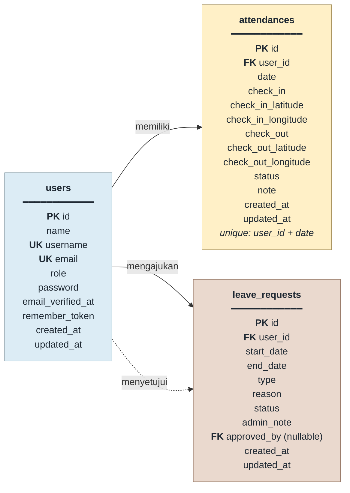
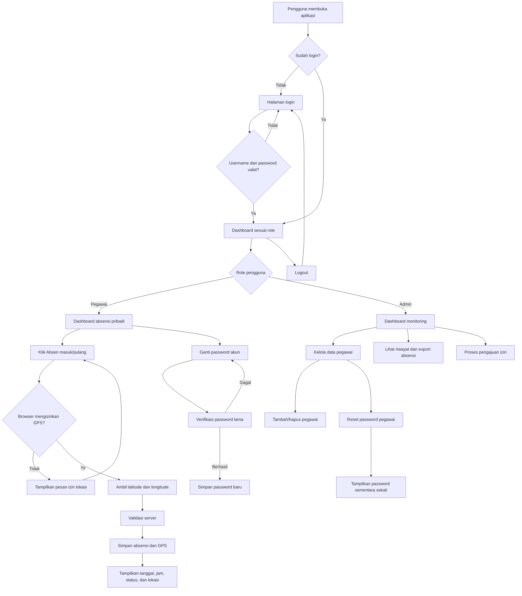

# AbsensiResto — Sistem Informasi Absensi Karyawan Rumah Makan

Aplikasi web untuk mengelola absensi karyawan rumah makan. Aplikasi dibangun dengan Laravel 12, PHP, PostgreSQL, dan Blade. Tampilan responsif sehingga dapat digunakan melalui laptop maupun perangkat mobile.

## 1. Teknologi

- PHP 8.4 pada container Docker
- Laravel 12
- PostgreSQL 16
- Blade Template Engine
- Apache
- Docker Compose
- Cloudflare Tunnel untuk akses publik saat development
- Browser Geolocation API untuk pencatatan GPS absensi

## 2. Role pengguna

Aplikasi hanya memiliki dua role.

### Admin

Admin dapat:

- Login ke aplikasi.
- Menambahkan akun pegawai.
- Menghapus akun pegawai.
- Mereset password pegawai dan mendapatkan password sementara baru.
- Melihat dashboard statistik.
- Melihat dan memfilter riwayat absensi seluruh pegawai.
- Melihat koordinat GPS saat pegawai absen masuk dan pulang.
- Menyetujui atau menolak pengajuan izin.
- Memberikan catatan pada pengajuan izin.
- Export absensi bulanan dalam format CSV.

### Pegawai

Pegawai dapat:

- Login ke aplikasi menggunakan akun yang dibuat admin.
- Melakukan absen masuk.
- Melakukan absen pulang.
- Menyimpan lokasi GPS saat absen masuk dan pulang.
- Melihat waktu dan koordinat absensinya sendiri.
- Melihat detail profil dan mengganti password akun dengan verifikasi password lama.
- Melihat status Hadir atau Terlambat.
- Mengajukan izin tidak masuk.
- Melihat status pengajuan izin.
- Export absensi pribadi berdasarkan bulan.

## 3. Akun admin

Akun admin awal dibuat otomatis oleh seeder:

```text
Username : admin
Password : password
```

Untuk keamanan, password admin sebaiknya segera diganti setelah instalasi pertama. Tidak ada akun pegawai demo yang dibuat otomatis. Semua akun pegawai harus ditambahkan sendiri oleh admin melalui menu **Data Pegawai**.

## 4. Fitur absensi

### Absen masuk dan pulang

Setiap pegawai hanya dapat memiliki satu catatan absensi per tanggal. Sistem menyimpan:

- Tanggal absensi
- Waktu masuk
- Waktu pulang
- Status absensi
- Latitude dan longitude saat masuk
- Latitude dan longitude saat pulang

Status otomatis menjadi **Terlambat** jika waktu absen masuk melewati pukul 08:00. Waktu terlambat ditampilkan dengan warna merah.

### GPS

Saat tombol absen ditekan, browser meminta izin lokasi. Jika izin diberikan, latitude dan longitude dikirim ke server dan disimpan pada data absensi.

GPS saat ini digunakan untuk pencatatan dan pemeriksaan manual. Pembatasan radius lokasi rumah makan belum diaktifkan.

Pada komputer, gunakan `http://localhost:8081`. Pada browser mobile, izin lokasi dan akurasi GPS bergantung pada perangkat, browser, serta pengaturan lokasi perangkat.

## 5. Fitur izin tidak masuk

Pegawai dapat membuat pengajuan izin dengan data:

- Tanggal mulai
- Tanggal selesai
- Jenis izin
- Alasan

Status awal pengajuan adalah **Menunggu**. Admin dapat mengubahnya menjadi **Disetujui** atau **Ditolak**, serta menambahkan catatan admin.

## 6. Export absensi

Export tersedia dalam format CSV dan dapat dibuka menggunakan Microsoft Excel, LibreOffice, atau Google Sheets.

- Admin: export data absensi seluruh pegawai berdasarkan bulan.
- Pegawai: export data absensi miliknya sendiri berdasarkan bulan.

## 7. Struktur folder utama

```text
absensi-rumah-makan/
├── app/
│   ├── Http/Controllers/
│   │   ├── AttendanceController.php
│   │   ├── AttendanceExportController.php
│   │   ├── AttendanceHistoryController.php
│   │   ├── AuthController.php
│   │   ├── DashboardController.php
│   │   ├── EmployeeController.php
│   │   └── LeaveRequestController.php
│   └── Models/
│       ├── Attendance.php
│       ├── LeaveRequest.php
│       └── User.php
├── database/
│   ├── migrations/
│   └── seeders/DatabaseSeeder.php
├── resources/views/
│   ├── auth/login.blade.php
│   ├── attendance/history.blade.php
│   ├── employees/index.blade.php
│   ├── leaves/index.blade.php
│   ├── layouts/app.blade.php
│   └── dashboard.blade.php
├── routes/web.php
├── Dockerfile
├── docker-compose.yml
└── README.md
```

## 8. Penjelasan controller

- `AuthController`: proses login dan logout.
- `ProfileController`: menampilkan detail profil dan mengganti password akun.
- `DashboardController`: menyiapkan statistik dan data dashboard.
- `AttendanceController`: proses absen masuk, absen pulang, validasi GPS, dan status keterlambatan.
- `AttendanceHistoryController`: filter dan pagination riwayat absensi admin.
- `AttendanceExportController`: menghasilkan file CSV absensi bulanan.
- `EmployeeController`: menambah, menghapus, dan mereset password akun pegawai.
- `LeaveRequestController`: membuat, melihat, menyetujui, dan menolak pengajuan izin.

## 9. Migration database

Migration dijalankan berurutan oleh Laravel melalui `php artisan migrate`.

| Migration | Kegunaan |
|---|---|
| `0001_01_01_000000_create_users_table.php` | Membuat tabel pengguna, password reset token, dan session. |
| `2026_10_07_000003_add_role_to_users_table.php` | Menambahkan kolom role dengan nilai awal `pegawai`. |
| `2026_10_07_000004_create_attendances_table.php` | Membuat tabel absensi, waktu masuk/pulang, status, dan catatan. Satu user hanya memiliki satu absensi per tanggal. |
| `2026_10_07_000005_normalize_roles.php` | Menormalkan nilai role pengguna agar hanya menggunakan role aplikasi yang valid. |
| `2026_10_07_000006_create_leave_requests_table.php` | Membuat tabel pengajuan izin, status, catatan admin, dan relasi approver. |
| `2026_10_07_000007_add_gps_to_attendances_table.php` | Menambahkan latitude dan longitude untuk absen masuk serta absen pulang. |
| `2026_10_07_000008_add_username_to_users_table.php` | Menambahkan username unik untuk login dan mengisi username pengguna lama. |

Relasi utama:

- Satu `User` memiliki banyak `Attendance`.
- Satu `User` memiliki banyak `LeaveRequest`.
- Penghapusan user menghapus data absensi dan pengajuan izinnya melalui cascade.
- `approved_by` pada pengajuan izin menunjuk ke user admin yang memprosesnya.

## 10. Schema database dan relasi

Schema aplikasi inti terdiri dari tiga tabel utama: `users`, `attendances`, dan `leave_requests`. Tabel `users` menjadi induk data pegawai, absensi, serta pengajuan izin.

### Diagram relasi (ERD)



> Garis putus-putus pada diagram menunjukkan relasi `approved_by`: satu admin dapat memproses banyak pengajuan izin. Kolom tersebut boleh kosong sebelum pengajuan diproses.

### Detail tabel aplikasi

| Tabel | Kolom penting | Relasi dan aturan |
|---|---|---|
| `users` | `id`, `name`, `username`, `email`, `role`, `password` | `username` dan `email` unik. `role` berisi `admin` atau `pegawai`. |
| `attendances` | `user_id`, `date`, `check_in`, `check_out`, empat kolom GPS, `status`, `note` | `user_id` → `users.id` dengan `cascadeOnDelete`. Kombinasi `user_id` + `date` unik, sehingga satu pegawai hanya punya satu absensi per hari. |
| `leave_requests` | `user_id`, `start_date`, `end_date`, `type`, `reason`, `status`, `admin_note`, `approved_by` | `user_id` → `users.id` dengan cascade. `approved_by` → `users.id` dengan `nullOnDelete`, sehingga riwayat izin tetap ada jika admin dihapus. |

### Relasi pada model Laravel

- `User::attendances()` adalah relasi `hasMany` ke `Attendance`.
- `Attendance::user()` adalah relasi `belongsTo` ke `User`.
- `User::leaveRequests()` adalah relasi `hasMany` ke `LeaveRequest`.
- `LeaveRequest::user()` adalah pegawai yang mengajukan izin (`belongsTo`).
- `LeaveRequest::approver()` adalah admin yang memproses izin (`belongsTo` melalui kolom `approved_by`).

Laravel juga membuat tabel pendukung untuk framework, yaitu `password_reset_tokens`, `sessions`, `cache`, `cache_locks`, `jobs`, `job_batches`, dan `failed_jobs`. Tabel-tabel tersebut tidak memiliki relasi bisnis tambahan dengan tabel absensi.

## 11. Flow aplikasi

Alur utama aplikasi berjalan seperti berikut:



Ringkasan proses:

1. Pengguna login menggunakan username dan password.
2. Sistem mengarahkan pengguna ke dashboard berdasarkan role `admin` atau `pegawai`.
3. Pegawai melakukan absen masuk atau pulang. Browser mengambil lokasi melalui Geolocation API.
4. Latitude, longitude, tanggal, jam, dan status absensi divalidasi lalu disimpan ke database.
5. Admin dapat memantau aktivitas, mengelola pegawai, mereset password, memproses izin, dan mengekspor absensi.
6. Pegawai dapat melihat absensi sendiri, mengajukan izin, export data pribadi, dan mengganti password akun.
7. Logout mengakhiri session dan mengembalikan pengguna ke halaman login.

## 12. Menjalankan dengan Docker

Pastikan Docker dan Docker Compose sudah terpasang, kemudian jalankan dari root project:

```bash
docker compose up --build
```

Aplikasi lokal tersedia di:

```text
http://localhost:8081
```

URL lokal alternatif: `http://127.0.0.1:8081`

URL publik Cloudflare Quick Tunnel :

```text
Bisa di cek dengan cara, cek logs service tunnel, docker logs namaservice-tunnel
```

URL publik Quick Tunnel bersifat sementara dan dapat berubah ketika container tunnel dibuat ulang. Untuk mendapatkan URL terbaru, jalankan `docker compose logs tunnel`.

Container yang digunakan:

- `app`: Laravel dan Apache.
- `db`: PostgreSQL 16.
- `tunnel`: Cloudflare Quick Tunnel untuk akses publik sementara.

Pada saat container `app` mulai, perintah berikut dijalankan otomatis:

```bash
php artisan key:generate --force
php artisan migrate --seed --force
apache2-foreground
```

Perintah umum:

```bash
# Menjalankan di background
docker compose up -d

# Melihat status container
docker compose ps

# Melihat log aplikasi
docker compose logs -f app

# Melihat URL Cloudflare Quick Tunnel
docker compose logs tunnel

# Menghentikan aplikasi
docker compose down
```

Database PostgreSQL disimpan dalam named volume `postgres_data`, sehingga data tetap ada ketika container dihentikan. Jangan menghapus volume database kecuali memang ingin menghapus seluruh data.

## 13. Menjalankan tanpa Docker

Mode tanpa Docker membutuhkan PHP, Composer, dan PostgreSQL yang sudah terpasang. Salin konfigurasi environment lalu sesuaikan koneksi database:

```bash
composer install
cp .env.example .env
php artisan key:generate
php artisan migrate --seed
php artisan serve
```

Kemudian buka:

```text
http://127.0.0.1:8000
```

Untuk PostgreSQL lokal, isi `.env` dengan nilai database yang sesuai. Container Docker tetap menjadi cara yang direkomendasikan untuk lingkungan project ini karena extension `pdo_pgsql` sudah tersedia di dalam image aplikasi.

## 12. Akses publik

Cloudflare Quick Tunnel yang ada di `docker-compose.yml` cocok untuk testing karena tidak membutuhkan domain dan akun berbayar. URL tunnel bersifat sementara dan dapat berubah ketika tunnel dibuat ulang.

Untuk deployment yang lebih stabil:

1. Siapkan domain milik sendiri.
2. Kelola DNS domain melalui Cloudflare.
3. Buat Cloudflare Named Tunnel.
4. Jalankan aplikasi pada server atau VPS yang aktif 24 jam.
5. Arahkan subdomain, misalnya `absensi.domainanda.com`, ke tunnel.

Menjalankan aplikasi dari laptop berarti aplikasi hanya dapat diakses selama laptop, Docker, dan koneksi internet tetap aktif.

## 13. Catatan keamanan sebelum digunakan sungguhan

- Ganti password admin bawaan.
- Jangan commit file `.env` ke repository publik.
- Gunakan `APP_ENV=production` dan `APP_DEBUG=false` pada server.
- Gunakan password PostgreSQL yang kuat.
- Aktifkan HTTPS pada domain publik.
- Batasi akses database agar tidak terbuka ke internet.
- Koordinat GPS merupakan data sensitif; tampilkan hanya kepada user yang berwenang.
- Backup database secara berkala.

## 14. Status pengembangan

Versi saat ini sudah mencakup login, dua role, manajemen pegawai, absensi masuk/pulang, status keterlambatan, GPS, pengajuan izin, persetujuan admin, export CSV, PostgreSQL, Docker Compose, serta tampilan responsif.

Pengembangan lanjutan yang dapat ditambahkan:

- Validasi radius GPS dari titik rumah makan.
- Pengaturan titik lokasi rumah makan dari dashboard admin.
- Peta interaktif untuk melihat lokasi absensi.
- Ganti password dari dalam aplikasi.
- Audit log aktivitas admin.
- Backup dan restore database melalui panel admin.
